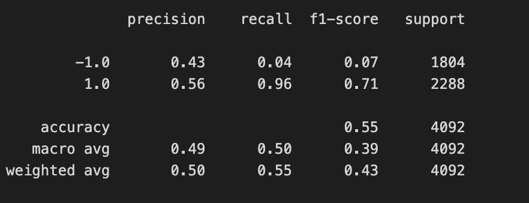
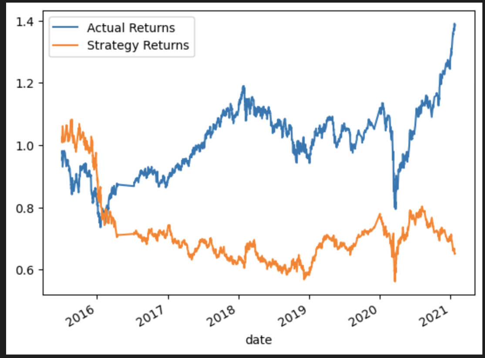
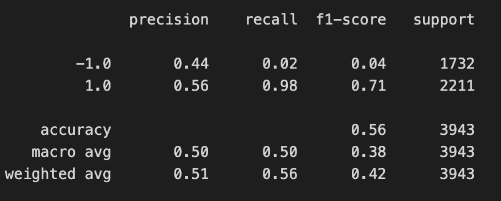
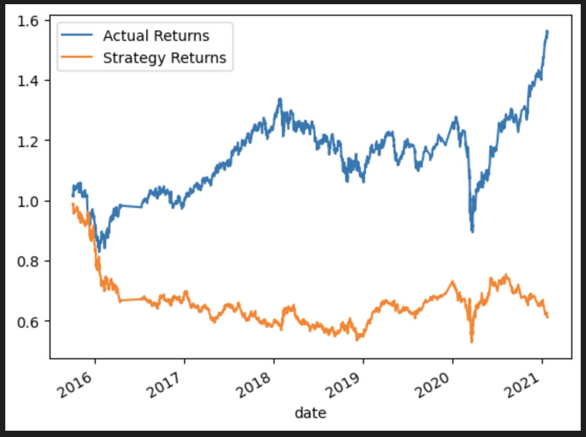
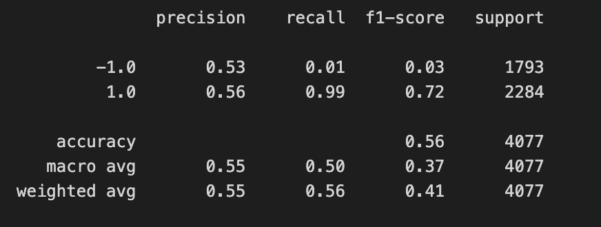
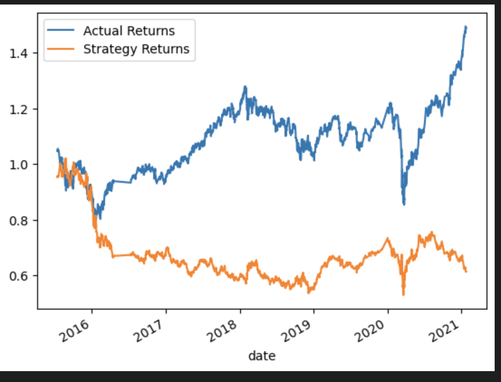
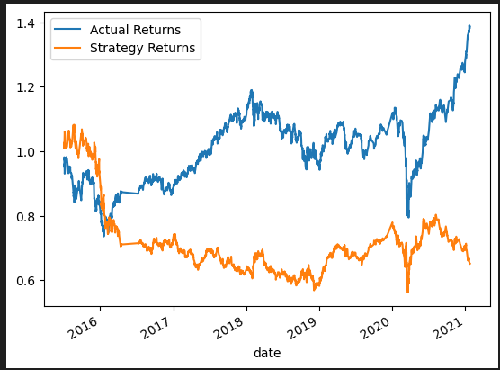

# Challenge 14 Algorithmic Trading and Machine Learning

In a Jupyter notebook, the following will be done:

* Implement an algorithmic trading strategy that uses machine learning to automate the trade decisions.

* Adjust the input parameters to optimize the trading algorithm.

* Train a new machine learning model and compare its performance to that of a baseline model.

A report is shown below that compares the performance of the machine learning models based on the trading predictions that each makes and the resulting cumulative strategy returns.

## Use an Alernative ML Model and evaluate strategy returns

Step 1: Tune the training algorithm by adjusting the size of the training dataset

For this exercise, it was suggested to slice the data into different periods. Afterwards, the Notebook was rerun. The results were then recorded below. 

Before the change was made to the training window, the following parameters were a part of the baseline for the training window:

The beginning of the training window started on 4/02/2015. The end was 7/02/15 due to the following formula: training_end = X.index.min() + DateOffset(months=3)

That resulted in the following classification report:

Consequently, that led to the following Cumulative Return Plot:

For this step, the training_end variable was changed to X.index.min() + DateOffset(months=6). That made the value change to 10/2/15. 

That resulted in the following classification report:

The following Cumulative Return Plot was then generated:

Step 2: Tune the trading algorithm by adjusting the SMA input features

For this step, the values changed in Step 1 were reset. In this step, the SMA window(s) are to be increased or decreased. 

The short_window was equal to four, and the long_window was equal to 100. When the head function was calculated, the first five dates were 4/2/15. The tail function's last five dates were 1/22/21.

For this step, I chose the following:

* short_window=7
* long_window=130

That resulted in the following classification report:

The following Cumulative Return Plot was then generated:

Step 3: Choose the set of parameters that best improved the trading algorithm returns

The best performing was making the offset from three to six months. 

## Backtesting the new model to evaluate performance

The baseline did slightly better than the Decision Tree Classifier in regards to accuracy. The accuracy for the baseline was at 0.55. For the Decision Tree, it was at 0.45. However, the precision was almost identical at 0.43 (-1.0)/0.56 (1.0) for the baseline and 0.44 (-1.0)/0.56 (1.0) for the Decision Tree. The recall numbers were very similar, but in an inverse fashion for -1.0 and 1.0. The cumulative report for the backtesting is shown below.

   
